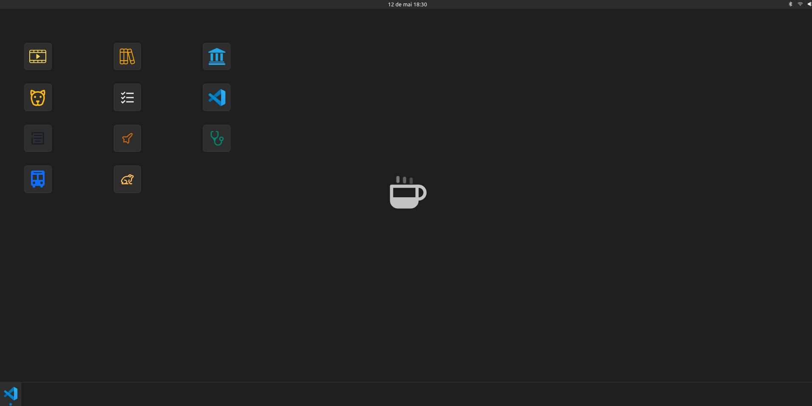

<h1 align="center">
  💻 Portfólio - Jefferson Guirra
</h1>

<h4 align="center"><a href="https://vscode-portfolio-developer.vercel.app/">Clique para visitar o projeto</a></h4>

## 📚 Seções

O site é composto por duas seções:

- **Home:** Simulando a área de trabalho no computador aqui é apresentado meus projetos pessoais;
- **Vscode:** Esta seção é produzida com base na interface do vscode contendo um pouco sobre mim, projetos pessoais, habilidades, contato e informações do github;

---

## 💼 Tecnologias utilizadas

Para o desenvolvimento do website utilizei as seguintes tecnologias:

- Typescript
- Next;
- Styled-components;
- Css-modules
- React-icons;
- Nodemailer;
- Nookies
---

